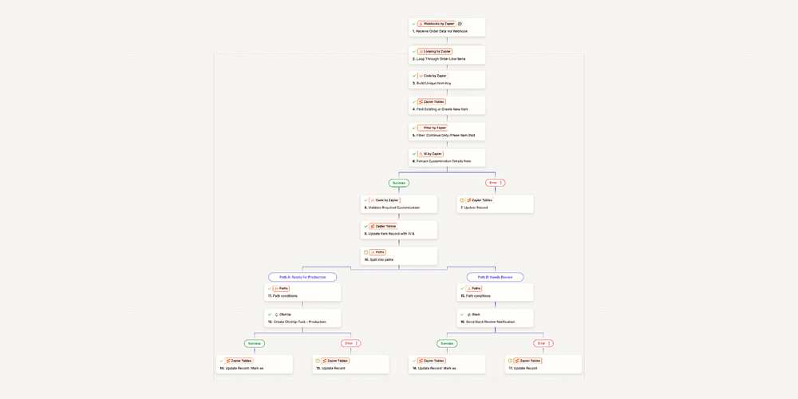
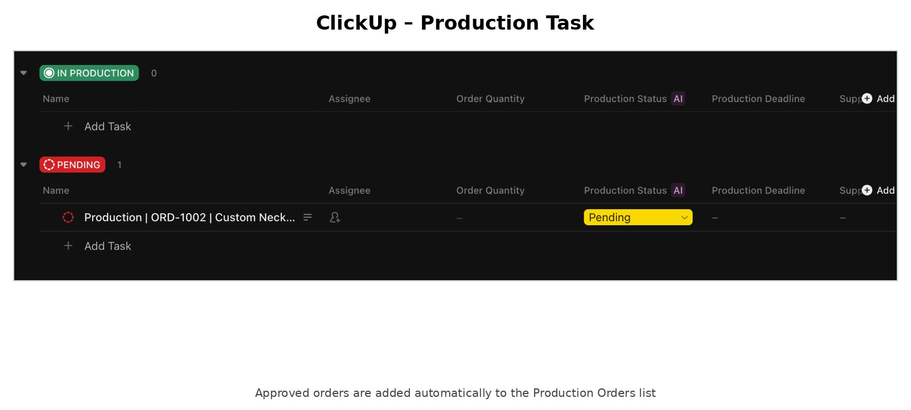
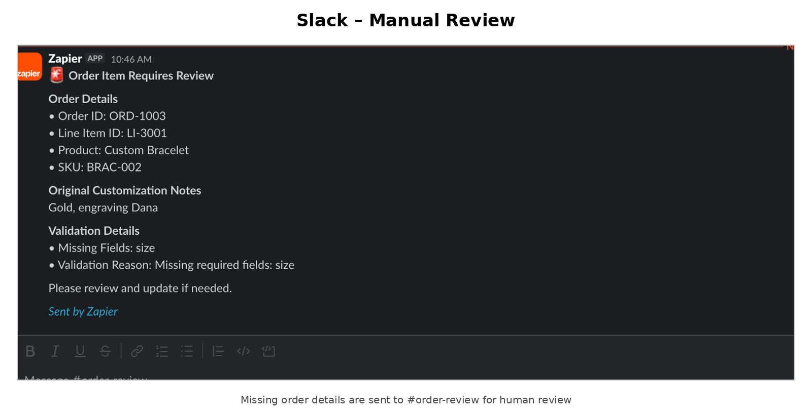

# AI Order Processing Automation

A Zapier workflow for processing custom e-commerce orders with AI.

The workflow receives an order, checks each item, extracts customization details from free-text notes, validates the result, and sends the item to the right next step.

- Complete order → create a production task in ClickUp
- Missing information → send the order to Slack for manual review
- Duplicate item → stop before AI processing
- Failed action → mark the item as `failed`

## The problem

Custom orders often contain notes like:

```text
Silver, 45cm, engraving NIV, gift box
```

Without automation, someone may need to:

- read the customer note
- understand the requested options
- check if anything is missing
- create a production task
- notify the team
- make sure the same item was not processed twice

This workflow handles most of that automatically.

## What it does

1. Receives order data through a webhook.
2. Loops through each line item.
3. Creates a unique key from `order_id + line_item_id`.
4. Checks Zapier Tables to see if the item was already processed.
5. Stops duplicate items.
6. Sends the customization note to AI.
7. Extracts:
   - material
   - size
   - engraving
   - gift box
   - extraction confidence
8. Validates the required fields.
9. Updates the order record.
10. Routes the item:
   - `approved` → ClickUp
   - `needs_review` → Slack
11. Uses native error handlers for AI, ClickUp, and Slack failures.

## Example 1 – approved order

Customer note:

```text
Silver, 45cm, engraving NIV, gift box
```

AI extraction:

```text
Material: Silver
Size: 45cm
Engraving: NIV
Gift box: Yes
Confidence: 0.9
```

Validation:

```text
Status: approved
```

Result: a production task is created in ClickUp.

## Example 2 – needs review

Customer note:

```text
Gold, engraving Dana
```

AI extraction:

```text
Material: Gold
Size: missing
Engraving: Dana
Gift box: No
Confidence: 0.9
```

Validation:

```text
Status: needs_review
Missing field: size
```

Result: the item is sent to the Slack `#order-review` channel for human review.

## Estimated time saved

The exact saving depends on the business and the order type.

A simple manual process like reading the note, checking the details, creating a task, and notifying the team can easily take around 3–5 minutes per order item.

If a store processes 50 custom order items in a day:

```text
50 items × 3 minutes = 150 minutes
50 items × 5 minutes = 250 minutes
```

That is roughly 2.5–4 hours of repetitive work per day.

This automation does not remove people from the process. It reduces the routine work and sends only incomplete or unclear orders for manual review.

> The time estimate above is an example, not a measured production benchmark.

## Workflow



The main flow handles order intake, item-by-item processing, duplicate protection, AI extraction, validation, routing, and error handling.

## ClickUp – approved order



When all required customization details are available, the workflow creates a production task in the `Production Orders` list.

## Slack – manual review



When required information is missing, the workflow sends the order details, missing fields, and validation reason to Slack.

## Tools used

- Zapier
- Webhooks by Zapier
- Looping by Zapier
- Code by Zapier
- Zapier Tables
- AI by Zapier
- Filters and Paths
- ClickUp
- Slack
- Hoppscotch for webhook testing

## Reliability and safeguards

- Duplicate protection using a stable `order_id + line_item_id` key
- AI only handles the free-text customization note
- Missing values are not guessed
- Required fields are validated before production
- Human review is used when information is missing
- Status changes are stored in Zapier Tables
- Native error handlers mark failed AI, ClickUp, or Slack actions as `failed`

## Status flow

```text
processing
    ↓
extracted_and_validated
    ↓
approved → task_created
needs_review → review_notified

error → failed
```

## Test cases

The workflow was tested with three main scenarios:

- Complete order → approved → ClickUp task created
- Missing required field → needs review → Slack notification sent
- Same item sent again → duplicate blocked before AI processing

Sample webhook payloads are available in the [examples](examples) folder.

The duplicate example intentionally uses the same order and line item IDs as the previous request. Sending it again demonstrates that the duplicate filter stops the item.

## Using it with a real store

Hoppscotch was used to simulate incoming orders while building and testing the workflow.

In a real setup, the source can be replaced with Shopify, WooCommerce, or another e-commerce system that can send order data through a native Zapier trigger or webhook.

The downstream logic can stay almost the same as long as these fields are mapped correctly:

- order ID
- line item ID
- product name
- SKU
- quantity
- customization notes

## Project structure

```text
.
├── README.md
├── code/
│   ├── build_unique_key.py
│   └── validate_customization.py
├── docs/
│   └── workflow.md
├── examples/
│   ├── approved-order.json
│   ├── needs-review-order.json
│   └── duplicate-order.json
└── screenshots/
    ├── zapier-workflow.jpg
    ├── clickup-production-task.jpg
    └── slack-review-notification.jpg
```

## What this project shows

This project demonstrates practical work with:

- API/webhook-based automation
- AI extraction from unstructured text
- validation logic
- deduplication
- branching workflows
- human-in-the-loop review
- status tracking
- error handling
- integrations between multiple business tools
