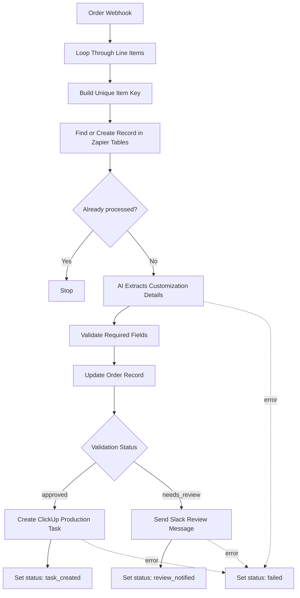
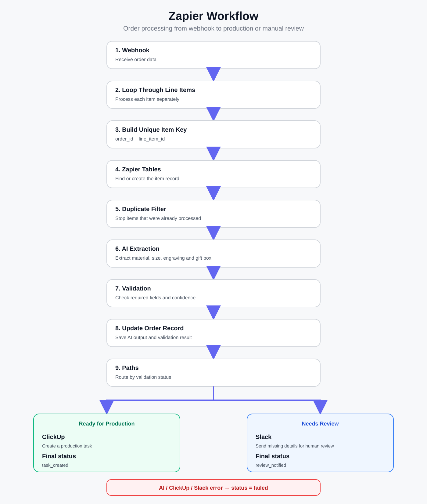
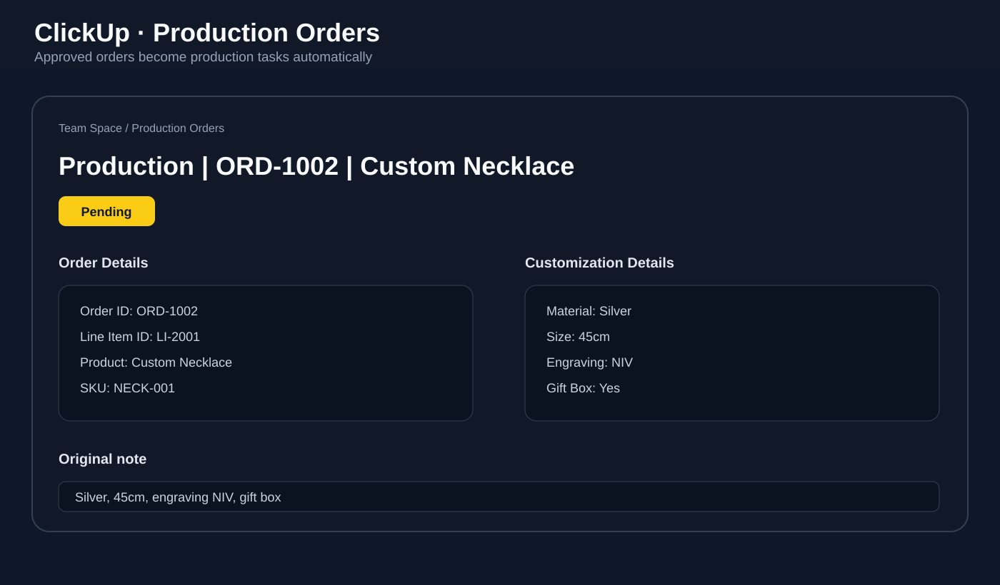
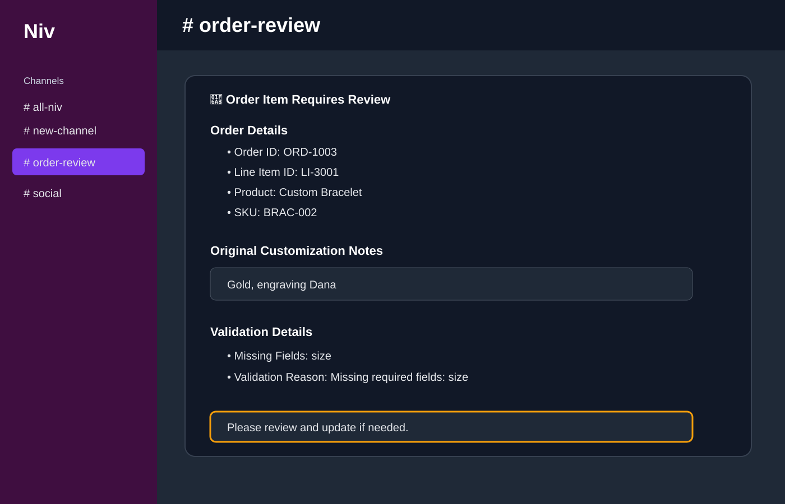

# AI Order Processing Automation

A Zapier workflow that processes custom e-commerce orders automatically.

It receives an order through a webhook, checks each item separately, extracts customization details with AI, validates the data, and sends the order to the right next step.

If the order is complete, a production task is created in ClickUp. If information is missing, the order is sent to Slack for manual review.

## Why I built it

Custom orders often include free-text notes such as:

```text
Silver, 45cm, engraving NIV, gift box
```

Someone usually has to read the note, understand the requested options, check if anything is missing, create a production task, and notify the team.

This workflow automates most of that process.

For a store that handles many custom orders, it can save a few minutes per order and reduce repetitive manual work.

## How it works

1. An order is received through a webhook.
2. Each line item is processed separately.
3. A unique key is created from the order ID and line item ID.
4. Zapier Tables checks if the item was already processed.
5. Duplicate items are stopped before AI processing.
6. AI extracts the customization details from the customer notes.
7. A validation step checks that the required fields are present.
8. The item is routed based on the result:
   - `approved` → create a production task in ClickUp
   - `needs_review` → send a Slack message for human review
9. The final status is stored in Zapier Tables.
10. Native error handlers mark failed runs as `failed`.

## Example

Input:

```text
Silver, 45cm, engraving NIV, gift box
```

AI output:

```text
Material: Silver
Size: 45cm
Engraving: NIV
Gift box: Yes
Confidence: 0.9
```

Validation result:

```text
Status: approved
```

The workflow then creates a task in the ClickUp `Production Orders` list.

If the input is:

```text
Gold, engraving Dana
```

the validation step detects that `size` is missing and sends the item to the Slack `#order-review` channel instead of sending it to production.

## Workflow




## Screenshots

### Zapier workflow

The main workflow receives the order, processes each line item, blocks duplicates, extracts customization details with AI, validates the result, and routes the item to the correct next step.



### ClickUp production task

When all required customization details are present, the workflow creates a production task in ClickUp automatically.



### Slack review notification

If required information is missing, the item is not sent to production. Instead, a message is sent to the `#order-review` Slack channel with the missing fields and validation reason.



## Tools used

- Zapier
- Webhooks by Zapier
- Looping by Zapier
- Code by Zapier
- Zapier Tables
- AI by Zapier
- Filters and Paths
- ClickUp
- Slack
- Hoppscotch for webhook testing

## Reliability

The workflow includes a few safeguards:

- Duplicate protection using a stable `order_id + line_item_id` key
- Human review when required information is missing
- No guessing of missing customization values
- Status tracking in Zapier Tables
- Native error handlers for AI, ClickUp, and Slack failures

## Test cases

The workflow was tested with:

- A complete custom order → approved → ClickUp task created
- An incomplete custom order → needs review → Slack notification sent
- The same order sent twice → duplicate blocked before AI processing

Sample payloads are available in the [examples](examples) folder.

## Using it with a real store

Hoppscotch was used to simulate incoming orders during development.

In a real setup, the webhook trigger can be replaced with Shopify, WooCommerce, or another e-commerce platform. The rest of the workflow can stay almost the same as long as the incoming order fields are mapped correctly.

## Project structure

```text
.
├── README.md
├── code/
│   ├── build_unique_key.py
│   └── validate_customization.py
├── docs/
│   └── workflow.md
└── examples/
    ├── approved-order.json
    ├── needs-review-order.json
    └── duplicate-order.json
```
